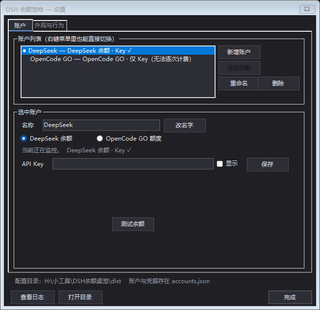

# DSH 余额桌宠

> 一个贴在桌面角落的小挂件：角色举着一块黑屏平板，板上的数字跟着你的 **DeepSeek 余额** 或
> **OpenCode GO 额度** 实时变——钱在掉，她就会红闪、震动、把刚掉的那一笔飘出来。

**下载即用** → [**Releases**](https://github.com/HiBer2007/DSH-PET/releases/latest) 里下 `DSH-PET.zip`，
解压，双击 `启动DSH余额宠物.vbs`。

**零安装**：.NET Framework 4.8 是 Windows 自带的系统组件（Win10 1903+ / Win11 都满足），
不用装 .NET SDK、不用 Node.js、不用配 PowerShell 模块。


## 它是什么

一个**独立的 Windows 桌面小程序**（不是 DSH 插件——DSH 关掉它照常跑）：它自己按秒轮询接口，
把"钱在掉"这件抽象的事变成看得见的反馈：**每一次扣费 = 一次红闪 + 一次震动 + 一次飘字 + 一声打击音**。

## 两种数据源，右键随时切

| 数据源 | 平板上的大数字 | 怎么"掉血" |
| --- | --- | --- |
| **DeepSeek 余额** | 余额（元） | 每下降一个「扣费数字」（默认 `0.03` 元）扣一次 |
| **OpenCode GO 额度** | 所选窗口的剩余额度（美元） | **按调用明细一笔一笔扣**，飘出的就是那次调用真实的美元花费（如 `-0.002411`） |

## 三个额度窗口是"套娃"，不是三笔钱

5 小时 / 本周 / 本月是**同一个池子的三个刻度**：5 小时 = 本月的 20%，本周 = 本月的 50%，
一次调用同时扣这三个。所以**上层用完了，下层就等于 0**——本周用完，哪怕 5 小时刚重置也照样调不动。

这时平板显示的不是"还剩多少"，而是 **「额度已用完 · 重置倒计时」**，并且倒计时取的是
**真正卡住你的那一层**的重置时间。当下层还有余量但上层是 0 时，平板会直接显示上层的状态。

## 峰 / 谷

平板角上一个字：**峰**（红）/ **谷**（绿）。两边时段相同（北京时间 09:00–12:00、14:00–18:00 的工作日），
**区别只在节假日**：

* **DeepSeek 官方 API**：周末和**中国法定节假日**都不算峰
* **OpenCode GO**：**没有节假日豁免**（这条是按实测账单核对的：国庆当天 09:45–11:59 的调用
  按全额峰值费率计费，而 12:39–12:59 的午间调用正好是半价）

## 还有

| | |
| --- | --- |
| **多账户** | 一个账户 = 一个身份 + 它自己的数据源；三四个账户随手切 |
| **GO 一键登录** | 内置浏览器窗口，正常登录一次即可，登录态只存在本机 |
| **说话气泡** | 双击角色召唤；只在关键节点自动冒（快用完 / 用完了 / 余额不足），阈值可调 |
| **点击穿透** | 整只宠物对鼠标透明，点得到它后面的东西；按住 **Ctrl** 随时抓回来 |
| **表情随额度变化** | 平板数字是什么颜色，脸上就是什么表情：充裕微笑、**扣血那一下**和用完难受、低于提醒线不高兴、没数据时平静。放在 `expressions\`，文件名就是用途（`calm` / `unhappy` / `hurt`）；随包带三张，右键可关 |
| **OBS 捕获模式** | 窗口采集**直接带透明通道，不用抠色**（见下） |
| 其它 | GO 额度轮播、尺寸 1.5–8cm、刷新频率 1–30 秒、位置（左下/右下镜像）、音效与音量 |

### 设置窗口

账户、Key、GO 登录、尺寸、频率、音效、提醒阈值——一个窗口全在里面；右键菜单保留常用项。



## 放进 OBS / 录屏

右键 →「**OBS 捕获模式**」，然后在 OBS 里：

1. 来源 **+ → 窗口采集** → 窗口选 **`DSH Balance Pet`**
2. 捕获方式选 **「Windows 10 (1903 及以上)」**

**直接就是带 alpha 的画面，不用绿幕、不用色度键**——这个开关不改变渲染，
只是让窗口"看起来像个普通应用窗口"，捕获器才肯读它（并且保留逐像素透明）。

代价：开着时它会像普通程序一样出现在**任务栏和 Alt+Tab** 里（被捕获器看见的前提），不直播时关掉即可。

## 从源码构建

需要 .NET Framework 4.8 开发者包（MSBuild）+ PowerShell 5.1。

```powershell
.\build.ps1                 # Release 构建，产物落在 dist\（绿色可运行）
.\build.ps1 -Test           # 跑单元测试
.\build.ps1 -Test -Deploy   # 构建 + 测试 + 安装到仓库根目录（本机自用）
```

运行时自检（会短暂开一个真实的挂件窗口）：

```powershell
cmd /c "dist\DshPet.exe --uicheck"   # 110 项断言：窗口身份/按键穿透/命中贴图/气泡动画/额度套娃…
cmd /c "dist\DshPet.exe --gosim"     # GO 记账对拍（与冻结的 PowerShell 版逐字节一致）
cmd /c "dist\DshPet.exe --shotgo"    # 渲染对拍，与 tests\_baseline 里的基准 PNG 比
```

换成自己的立绘/音效：替换 `sprite.png` / `hit.mp3`，并跑 `tools\make_sprite.ps1` 重新标定平板四角。
想加自己的表情：往 `expressions\` 里丢 PNG，**文件名决定用途**（`calm` / `unhappy` / `hurt`，
同名多张按次轮换）——**构图必须和 `sprite.png` 一致**，因为平板四角是写死的；
`--uicheck` 会逐张量给你看（含基准图）。运行中替换也行，贴图不再锁文件。

## 文档

* [**先看这里（快速开始）.md**](先看这里（快速开始）.md) —— 给使用者：怎么启动、怎么填 Key、怎么登 GO、常见问题
* [**说明文档.md**](说明文档.md) —— 完整文档：原理、实现细节、踩过的坑、排错

## 隐私

**不联网上传任何数据。** 只访问 DeepSeek 官方余额接口，以及（切到 GO 时）opencode.ai 控制台的
额度与调用明细接口。Key 与 Cookie 只存在本机（`accounts.json`），
这个文件**已在 `.gitignore` 里**——不会被提交，也请不要外发。

## 关于仓库里那个 PowerShell 版

`pwsh_version/dsh_pet.ps1` 是最初的 PowerShell 实现（**冻存，不再改动**）。
C# 版是从它逐条对拍移植过来的：`--gosim` / `--simchain` / `--shotgo` 三套对拍保证两边算出来完全一致。

## 素材来源

角色与四张表情来自 [VKmich16/VK-1](https://github.com/VKmich16/VK-1)（MIT）的 `大肥鱼桌宠改_D-16BVM/sprites`：
静止立绘用 `expression_11`，`expression_12 / 21 / 22` 分别作为不高兴 / 平静 / 难受。

## License

[LGPL-2.1](LICENSE)

---

<details>
<summary><b>English</b></summary>

**DSH Balance Pet** — a tiny Windows desktop widget: a character holds a tablet whose number tracks your
**DeepSeek balance** or your **OpenCode GO quota**. Every charge makes her flash red, shake, and float the
amount she just lost.

Download `DSH-PET.zip` from [Releases](https://github.com/HiBer2007/DSH-PET/releases/latest), unzip it and
double-click the `.vbs`. Nothing to install: .NET Framework 4.8 ships with Windows 10 1903+ / 11.

* **Two sources.** DeepSeek balance (charges in configurable steps) and OpenCode GO quota, which is billed
  **per API call** from the console's call log — so the floating number is that call's real cost in dollars.
* **The three GO windows are one pool, not three.** The 5-hour window is 20% of the monthly one, the weekly
  window 50%, and a single call spends all three, so an exhausted upper window zeroes the lower view. The
  tablet then shows *"quota exhausted · reset countdown"*, counting down to the reset of the window that is
  actually blocking you.
* **Peak / off-peak tag** (峰/谷) on the tablet. Both providers peak 09:00–12:00 and 14:00–18:00 Beijing time
  on weekdays; DeepSeek additionally skips weekends and Chinese public holidays, OpenCode GO does not
  (verified against a real invoice: National Day calls were billed at the full peak rate).
* **Multi-account** (an account = an identity + its own data source), one-click GO sign-in through an embedded
  WebView2 window, speech bubbles on the moments that matter, click-through (hold **Ctrl** to grab the pet).
* **OBS capture mode**: a single switch that makes the window an ordinary application window. Window Capture
  (Windows 10 1903+) then yields the overlay **with real alpha — no colour key, no green screen**.
* 206 unit tests, 110 runtime `--uicheck` assertions, and three differential harnesses against the frozen
  PowerShell original.

Built with WinForms + GDI+ layered windows (`UpdateLayeredWindow`) on .NET Framework 4.8, with a small amount
of Win32 P/Invoke for the z-order, click-through and hit-testing behaviour.

</details>
